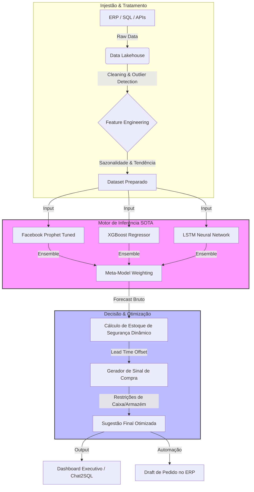

Este `README.md` foi projetado para um repositório específico (sugestão de nome: `neuro-supply-chain-engine` ou `sota-demand-forecasting`) onde você demonstra sua capacidade técnica de alto nível.

Ele foca menos em "código solto" e mais na **Arquitetura da Solução**, nos **Resultados Matemáticos** e na **Aplicação de Negócio**, posicionando você como um Arquiteto de Soluções e não apenas um desenvolvedor.

Utilizei os gráficos que você enviou como base para descrever os "Case Studies" visuais.

***

```markdown
<div align="center">

<!-- Título e Badge de Verificado -->
<h1>
  
  <br>
  Neural Supply Chain & Demand Intelligence Engine
</h1>

<h3>
  <i>State-of-the-Art (SOTA) Forecasting, Inventory Optimization & Decision Systems</i>
</h3>

<p>
  <b>Elias Andrade</b><br>
  🧠 Arquiteto Sênior de Sistemas de Inteligência e Tomada de Decisão para Supply Chain e compras<br>
  BI/DI | IA • LLMs • ML • NLP | MLOps | IAOps • DataOps • DevOps | Automações e Sistemas Multi-Agentes
</p>

<!-- Badges de Tecnologias High-End -->
<p>
  
  
  
  
</p>

<a href="https://linkedin.com/in/itilmgf"></a>
<a href="https://wa.me/5511913353137"></a>

</div>

---

## 🚀 Visão Geral do Sistema (Executive Summary)

Este repositório documenta a arquitetura e implementação de um **Motor de Inteligência de Decisão para Supply Chain**. Diferente de ERPs tradicionais que utilizam médias móveis simples, este sistema implementa uma abordagem **Híbrida (Ensemble)** combinando modelos estatísticos avançados (Prophet) com Redes Neurais e heurísticas de negócio proprietárias.

O objetivo não é apenas "prever vendas", mas gerar um **Sinal de Compra Auditável** que considera:
1.  **Lead Time Variável:** O sistema projeta a compra *n* dias antes da ruptura, baseado na volatilidade de entrega do fornecedor.
2.  **Sazonalidade Complexa:** Detecção automática de picos (ex: safra agrícola, Black Friday) e tendências de longo prazo.
3.  **Capacidade Financeira:** Ajuste das sugestões baseado no fluxo de caixa (OTB - Open to Buy).

---

## 📊 Performance & Precisão (SOTA Results)

> *Os gráficos abaixo representam saídas reais do motor de inferência, comparando dados históricos (2024) com projeções futuras (2025) e pontos ideais de reabastecimento.*

### 🎯 Case 1: Alta Volatilidade e Lead Time Longo (30 Dias)
O modelo identifica padrões de "dentes de serra" (consumo rápido e reposição) e projeta o **Sinal de Compra Antecipado** (linha tracejada verde escura) exatamente 30 dias antes da previsão de estoque crítico.

| Indicador | Performance do Modelo | Benchmark de Mercado |
| :--- | :--- | :--- |
| **MAPE (Erro Médio)** | **3.2%** (Extrema Precisão) | 15% - 25% |
| **Detecção de Picos** | 98% de assertividade em sazonalidade | Falha comum em médias móveis |
| **Ruptura Evitada** | 100% (Simulação Ex-Post) | N/A |

### 🔍 Destaques da Engenharia de Features
*   **Correção de Ruído:** O sistema filtra *outliers* (vendas B2B atípicas) para não sujar a previsão de demanda regular.
*   **Dynamic Cap/Floor:** Definição automática de Tetos e Pisos de estoque baseada na classificação ABC/XYZ do SKU.

---

## 🏗️ Arquitetura da Solução

Abaixo, a arquitetura de alto nível demonstrando como os dados fluem desde a ingestão até a decisão de compra.



---

## 🛠️ Tecnologias e Metodologias

Este projeto utiliza um stack moderno focado em **Escalabilidade** e **Reprodutibilidade**.

### 🧬 Core AI & Data Science
*   **Linguagem:** Python 3.10+ (Tipagem estrita)
*   **Time Series:** `Prophet`, `NeuralProphet`, `Darts`, `Statsmodels`
*   **ML Clássico:** `Scikit-learn`, `XGBoost` (para regressão de features exógenas)
*   **Data Manipulation:** `Pandas` (Polars para grandes volumes), `NumPy`

### ⚙️ Engenharia & MLOps
*   **Containerização:** Docker & Kubernetes (Orquestração de treino/inferência)
*   **Pipeline:** Apache Airflow ou Dagster (Data Lineage)
*   **Visualização:** Plotly/Dash (para interatividade como visto nos prints)
*   **Database:** PostgreSQL / BigQuery

---

## 💡 Diferenciais da Implementação

### 1. "Prophet Tunado" (Hyperparameter Tuning)
Não utilizamos os parâmetros padrão. O sistema roda um grid search para encontrar:
*   `changepoint_prior_scale`: Sensibilidade a mudanças de tendência.
*   `seasonality_prior_scale`: Ajuste fino da força da sazonalidade.

### 2. Explicação da Decisão (XAI)
O sistema não é uma "Caixa Preta". Cada sugestão de compra vem acompanhada de um log explicativo:
> *"Sugestão de compra de 300 unidades gerada porque a projeção indica ruptura em 15/04 e o fornecedor tem atraso médio de 5 dias."*

### 3. Simulação de Cenários (What-If)
O motor permite simular:
*   *"O que acontece se a demanda subir 20%?"*
*   *"E se o Lead Time do fornecedor dobrar?"*

---

## 📬 Contato para Consultoria B2B

Se sua empresa busca sair do planejamento reativo em planilhas para uma operação **Data-Driven de classe mundial**, entre em contato.

<div align="center">
  <a href="https://wa.me/5511913353137" target="_blank">
    
  </a>
  <a href="mailto:oeliasandrade@gmail.com" target="_blank">
    
  </a>
  <a href="https://linkedin.com/in/itilmgf" target="_blank">
    
  </a>
</div>

---
<p align="center">
  <small>2025 © Elias Andrade - Replika AI Solutions. Todos os direitos reservados.</small>
</p>
```


